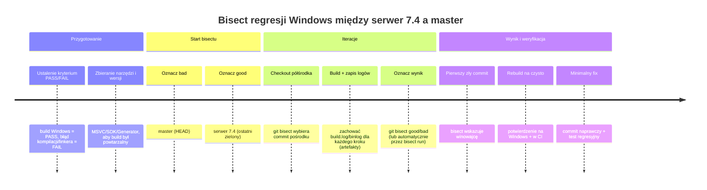

# Analiza awarii buildu Windows po wprowadzeniu dopasowania tekstu zależnego od języka

## Podsumowanie wykonawcze

Awaria buildu na Windows po dodaniu „language-aware text-field matching” najczęściej wynika nie z samej logiki porównywania, ale z efektów ubocznych: nowych zależności (ICU/Boost/WinNLS), różnic w kodowaniu (UTF‑8 ↔ UTF‑16), zmian w preprocesorze i makrach, albo problemów konsolidacji/ABI (ODR, niezgodne ustawienia CRT, linkowanie nie tych bibliotek). Windows jest tu szczególnie „czuły”, bo API systemowe preferuje UTF‑16, a MSVC ma własny zestaw ostrzeżeń i mechanikę PDB/linkera. citeturn4search6turn4search0turn4search1turn13search1turn13search0

Najkrótsza, najmniej „intuicyjna” droga do ustalenia winowajcy jest proceduralna:

1) **Zebrać kompletne logi Windows** (najlepiej MSBuild `.binlog` + surowy log konsoli, albo pełne komendy kompilatora przez `compile_commands.json`). MSBuild ma dedykowane przełączniki do szczegółowych logów i logów binarnych. citeturn2search0turn2search9turn2search5turn24search11turn2search2  
2) **Porównać master vs `serwer 7.4` po wspólnym przodku (merge-base)**, ograniczając zakres do `.cpp`, a potem zawęzić do commitów, które zmieniają ścieżki powiązane z dopasowaniem tekstu/locale/Unicode. Git dostarcza do tego gotowe mechanizmy (`merge-base`, `diff`, `log --left-right`, `range-diff`). citeturn20search1turn0search1turn0search3turn0search0  
3) **Uruchomić `git bisect`** z automatycznym buildem na Windows, aby znaleźć pierwszy „zły” commit. `git bisect` działa binarnie (log2 N buildów), więc nawet przy dużej historii jest szybki. citeturn0search2turn0search6  
4) Po wskazaniu commita: **mapować symptom → klasa problemu** (błąd kompilatora vs linkera vs ostrzeżenia jako błędy), a następnie zastosować typowe dla Windows remediacje: ujednolicenie CRT (/MD vs /MT), naprawa ODR, dopięcie bibliotek ICU/Boost/WinNLS, poprawa konwersji UTF‑8/UTF‑16, ustawienie `/utf-8`, doprecyzowanie `_WIN32_WINNT`, itp. citeturn14search5turn13search1turn13search0turn13search2turn11search2

Uwaga praktyczna: mam możliwość przeglądania publicznie dostępnych informacji w sieci (w tym publicznych repozytoriów w entity["company","GitHub","code hosting platform"]), ale nie mam automatycznego, uwierzytelnionego dostępu do Twojego prywatnego repo/CI. Poniższy raport jest więc „rigorystycznym playbookiem” (komendy, heurystyki, wzorce), który pozwala Wam samodzielnie zidentyfikować commit i mechanizm awarii, oraz szybko przygotować poprawkę.

## Zakres i założenia diagnostyczne

Istotne niewiadome, które wpływają na diagnozę: (a) kompilator (MSVC vs MinGW GCC vs clang-cl), (b) system budowania (MSBuild/Visual Studio, CMake+Ninja, Make), (c) CI (GitHub Actions / Azure Pipelines / inny), (d) typ awarii: kompilacja, linkowanie, czy testy uruchamiane po zbudowaniu. W raporcie zakładam, że build jest „native C++” (nie .NET-only), a logika „language-aware matching” mogła wprowadzić: locale-aware case mapping, kolację (collation), normalizację Unicode, ignorowanie diakrytyków, bądź konwersje kodowań. citeturn3search0turn3search1turn11search4turn18search1

Windows kluczowo różni się tym, że szeroko stosuje UTF‑16 w API Win32, a konwersje UTF‑8↔UTF‑16 realizuje się zazwyczaj przez `MultiByteToWideChar` i `WideCharToMultiByte`. citeturn4search6turn4search0turn4search1turn4search4  
W warstwie CRT/locale Windows ma też osobne mechanizmy „per-thread locale”, kontrolowane przez `_configthreadlocale`, a funkcje typu `tolower` i `towlower` są zależne od bieżących ustawień regionalnych. citeturn4search9turn7search4turn7search7

Wskazówka: zanim zaczniecie optymalizować dopasowanie tekstu, najpierw „zdejmijcie mgłę” z narzędzi: pełne logi, pełne komendy kompilatora, oraz jedna, deterministyczna metoda porównania gałęzi.

## Porównanie master vs serwer 7.4

### Ustalenie wspólnego przodka i zakresu porównania

Porównanie „gałąź vs gałąź” jest najbardziej wiarygodne, gdy najpierw wyznaczycie **merge-base** (najlepszy wspólny przodek) i dopiero potem analizujecie zakres commitów, które rzeczywiście różnią historie. `git merge-base` służy dokładnie do znajdowania takiego przodka. citeturn20search1

Minimalny, bezpieczny zestaw komend (zarówno Bash, jak i PowerShell):

```bash
git fetch --all --prune
git merge-base master "serwer 7.4"
```

Następnie pracujcie na zakresach:

- `A..B` (commity osiągalne z B, ale nie z A) – przydatne do listowania „co weszło do mastera od czasu serwer 7.4”.
- `A...B` (różnice symetryczne) – przydatne do zestawień „lewo/prawo”.  

Konkretnie: `git diff` i `git log` obsługują ograniczenie do ścieżek (`[--] <path>...`), co pozwala przyciąć analizę do `.cpp`. citeturn0search1turn20search3turn0search3

### Strategie diff i znajdowanie commitów dotykających `.cpp`

Ważne jest, by nie utknąć w „mega-diffie” po wielu edycjach. Zalecany porządek:

1) **Lista zmienionych plików `.cpp`** (szybko pokazuje skalę i hotspoty):

```bash
git diff --name-status "serwer 7.4"...master -- '*.cpp'
git diff --stat        "serwer 7.4"...master -- '*.cpp'
```

`git diff` potrafi generować zarówno listę, jak i statystyki (`--stat`) i podsumowania zmian plików (`--summary`). citeturn0search1turn20search3

2) **Lista commitów unikalnych dla strony master**, z eliminacją cherry-picków (często kluczowe, gdy różne gałęzie przenosiły poprawki):

```bash
git log --oneline --left-right --cherry-pick "serwer 7.4"...master -- '*.cpp'
```

Opcje `--left-right` i `--cherry-pick` są opisane w dokumentacji `git log`. citeturn0search3

3) **Zakres „patch series” i różnice rebasa / integracji**: jeśli PR był rebazowany lub squashowany, użyjcie `git range-diff`, który porównuje zakresy commitów i dopasowuje „odpowiadające sobie” patche. citeturn0search0turn0search4

Przykład (schematyczny):

```bash
# (przykład) porównanie dwóch wersji serii commitów
git range-diff base..master base.."serwer 7.4"
```

4) **Wyszukiwanie „podejrzanych” zmian po treści** (Unicode, locale, ICU, Boost.Locale, CompareStringEx, LCMapStringEx, NormalizeString). W praktyce taki grep w historii jest często szybszy niż ręczne przeglądanie setek commitów:

```bash
git log -p "serwer 7.4"...master -- '*.cpp' \
  -G 'LCMapStringEx|CompareStringEx|NormalizeString|MultiByteToWideChar|WideCharToMultiByte|std::locale|tolower|towlower|codecvt|wstring_convert|boost::locale|icu'
```

5) Jeśli część zmian była robiona „hurtowo” w wielu `.cpp`, warto też zbudować histogram plików dotkniętych zmianami (to już zwykle skryptem), a następnie czytać diff tylko dla top N.

### Jak zawężać do zmian relewantnych dla dopasowania tekstu

W przypadku „language-aware matching” najbardziej relewantne są pliki, które:

- dotykają granic systemu (IO, UI, sieć), gdzie następuje konwersja kodowania,
- wprowadzają lub zmieniają zależności bibliotek (ICU/Boost/Win32 NLS),
- modyfikują globalne ustawienia locale/CRT,
- zmieniają interfejsy symboli (DLL export/import, inline, template). citeturn19search1turn13search0turn13search1turn4search9

W praktyce: po wygenerowaniu listy zmienionych `.cpp`, wyodrębnijcie te zawierające słowa kluczowe: `locale`, `utf`, `unicode`, `collation`, `normalize`, `casefold`, `diacritic`, `ICU`, `Boost.Locale`, `CompareString`, `LCMapString`, `NORM_IGNORE*`, `LINGUISTIC_*`.

## Pozyskanie i analiza logów buildu Windows

### Jak pozyskać logi niezależnie od toolchaina

Ponieważ narzędzia są nieustalone, rekomenduję „warstwowy” sposób zbierania:

- **Jeśli używacie MSBuild/Visual Studio**: generujcie **binlog** (`.binlog`) oraz log tekstowy. MSBuild pozwala ustawić poziomy szczegółowości (`-v:diag`) i ma przełącznik do logu binarnego (`-bl`). citeturn2search0turn2search9turn2search5turn2search6  
  Binlog najwygodniej analizować w **MSBuild Structured Log Viewer**. citeturn2search2turn2search9

- **Jeśli używacie CMake**: włączcie eksport `compile_commands.json`, który zawiera dokładne wywołania kompilatora dla każdej jednostki tłumaczenia (`CMAKE_EXPORT_COMPILE_COMMANDS`). citeturn24search0

- **Jeśli używacie GitHub Actions / Azure Pipelines**: pobierzcie logi runu oraz artefakty (np. binlog, compile_commands.json). W entity["company","Microsoft","software vendor"] dokumentacji opisano pobieranie logów MSBuild/CI, a dokumentacja GitHub Actions opisuje pobieranie logów i artefaktów oraz domyślną retencję. citeturn10search4turn10search0turn10search1turn10search21

Jeśli CI jest w GitHub Actions, sensowny minimalny zestaw to:
- logi runu + artefakt „build-logs” (zawierający `*.binlog`, `build.log`, `compile_commands.json`, `CMakeCache.txt`, `vcpkg-manifest-info.json` lub analogiczny plik zależności).

GitHub CLI wspiera pobieranie artefaktów (`gh run download`) i podgląd runów (`gh run view`). citeturn23search0turn23search2turn10search4

### Jak „czytać” log: klasyfikacja problemu

W Windows C++ logi zwykle szybko da się sklasyfikować po sygnaturach:

- **Błędy kompilatora (MSVC)**: `error C####`, `fatal error C####`.
- **Błędy linkera (MSVC)**: `error LNK####` (np. LNK2019, LNK2005, LNK2038), a na końcu często LNK1120 jako licznik nierozwiązanych symboli. citeturn13search12turn13search0turn13search1turn15search7
- **MinGW/Clang/GCC**: typowo `: error:` / `: undefined reference` / `collect2: error`.

Kluczowe: **najpierw wyciągnąć pierwsze 20–50 unikalnych błędów** (często kolejne są kaskadą). W MSBuild binlog to jest łatwe, bo widać dokładnie, który „Task” i która komenda `cl.exe` / `link.exe` poszła. citeturn2search9turn2search2

### Proste parsowanie logów (PowerShell i Bash)

PowerShell (MSVC – wyciąganie błędów `C####` i `LNK####` + kontekst):

```powershell
$log = "build.log"

# Unikalne błędy kompilacji
Select-String -Path $log -Pattern 'error C\d{4}|fatal error C\d{4}' |
  ForEach-Object { $_.Line } |
  Sort-Object -Unique

# Unikalne błędy linkera
Select-String -Path $log -Pattern 'error LNK\d{4}|fatal error LNK\d{4}' |
  ForEach-Object { $_.Line } |
  Sort-Object -Unique

# Ostrzeżenia, jeśli macie /WX (warto sprawdzić, czy build pada na warningu)
Select-String -Path $log -Pattern 'warning C\d{4}|warning LNK\d{4}' |
  ForEach-Object { $_.Line } |
  Sort-Object -Unique
```

Bash (analogicznie):

```bash
grep -E 'error (C|LNK)[0-9]{4}|fatal error (C|LNK)[0-9]{4}' build.log | sort -u
grep -E 'warning (C|LNK)[0-9]{4}' build.log | sort -u
```

### Najczęstsze „windowsowe” przyczyny w logach i co znaczą

Poniżej zestaw najczęściej spotykanych klas awarii, które pasują do „wprowadziliśmy językowo‑zależne dopasowanie”:

- **LNK2019 / LNK2001 / LNK1120**: używają symbolu, ale nie ma definicji albo nie dołączono biblioteki/obiektu do linkowania. To bywa brak dodania nowej biblioteki (np. ICU), złe warunki preprocesora, albo inna sygnatura funkcji (np. calling convention). citeturn13search12turn6search3turn15search7  
- **LNK2005**: naruszenie zasady jednej definicji (ODR) – często po dodaniu „helpera” jako globalu/statyka, albo po przeniesieniu definicji do niewłaściwego miejsca. citeturn13search0  
- **LNK2038**: mismatch ustawień między modułami (często CRT, iterator debug level, inne definicje symboli w `#pragma detect_mismatch`). W praktyce: mieszanie bibliotek z innymi flagami (/MD vs /MT / debug vs release). citeturn13search1turn14search5turn14search13  
- **C4819**: plik źródłowy ma znaki nieprzedstawialne w bieżącej stronie kodowej – typowe po edycji plików i dodaniu znaków diakrytycznych w literałach/komentarzach bez wymuszenia UTF‑8. Rozwiązaniem jest `/utf-8` lub zapis plików w Unicode. citeturn15search0turn13search2  
- **C5105** i inne ostrzeżenia preprocesora**: potrafią wyjść po zmianach w makrach i przejściu na bardziej zgodny preprocesor (`/Zc:preprocessor`). citeturn9search5turn13search14  
- **C4996 / STL4017**: kompilacja pada na deprecacji (np. `<codecvt>`, `std::wstring_convert`) gdy macie włączone „warnings as errors” (/WX). MSVC STL wprost wskazuje makra do wyciszenia, ale to raczej obejście; docelowo lepiej przejść na stabilne konwersje Win32 lub ICU. citeturn21search11turn22search3turn21search13turn4search0turn4search1

### Schemat diagnostyczny jako flowchart

```mermaid
flowchart TD
  A[Build Windows пада] --> B[Zbierz pełne logi: binlog / compile_commands / raw log]
  B --> C{Typ awarii?}
  C -->|Kompilacja| D[Wyodrębnij pierwsze błędy C#### / fatal]
  C -->|Linkowanie| E[Wyodrębnij LNK####, sprawdź LNK1120]
  C -->|Testy po buildzie| F[Zbierz stack trace + PDB, zidentyfikuj moduł]
  D --> G{Czy to Unicode/locale?}
  G -->|Tak| H[/utf-8, konwersje UTF-8↔UTF-16, API WinNLS/ICU]
  G -->|Nie| I[Include/makra/preprocessor, platform guards, brak nagłówka]
  E --> J{Czy to ODR/mismatch?}
  J -->|LNK2005| K[Znajdź duplikaty definicji, inline/static, TU boundaries]
  J -->|LNK2038| L[Ujednolić CRT/flags, rebuild bibliotek]
  J -->|LNK2019/2001| M[Brak biblioteki/obiektu, zła sygnatura, calling conv]
  H --> N[Dodaj testy Unicode + regresyjne]
  I --> N
  K --> N
  L --> N
  M --> N
  N --> O[git bisect / potwierdzenie poprawki w CI]
```

## Hipotezy i lista kontrolna dla zmian językowo‑zależnych

Poniższa lista kontrolna jest celowana w regresje typowe dla „językowo świadomego dopasowania” na Windows. Źródła w tej sekcji wskazują, *dlaczego* dana oś ryzyka istnieje (locale-dependent case mapping/collation, Unicode normalization, Win32 NLS flags, konwersje UTF‑8/UTF‑16). citeturn11search4turn12view0turn3search1turn18search1turn4search4

### Locale i funkcje zależne od bieżących ustawień regionalnych

- Czy nowy kod używa `tolower/towlower` i zakłada „Unicode”, podczas gdy funkcje te są zależne od `LC_CTYPE` i bieżącego locale? citeturn7search4turn7search7  
- Czy gdziekolwiek wywoływane jest `setlocale` / `_wsetlocale` albo modyfikowana jest globalna/ per-thread konfiguracja locale (`_configthreadlocale`)? Na Windows to może wpływać na inne wątki, jeśli per-thread locale nie jest włączone. citeturn4search9turn4search13turn4search16  
- Czy w środowisku Windows istnieje wymagany locale name dla `std::locale("…")`? To bywa problemem testów (runtime), bo nazwy locale są platformowe.

### Wide vs narrow i granice UTF‑8 / UTF‑16

- Czy nowa logika zmieniła typy: `std::string` ↔ `std::wstring` / `wchar_t`? Windows API opisuje, że Unicode w Win32 jest UTF‑16 i może używać jednej lub dwóch 16‑bitowych wartości dla znaku. citeturn4search6turn4search3  
- Czy konwersje są jawne i walidujące (np. `CP_UTF8` + `MB_ERR_INVALID_CHARS`), czy „ciche” i potencjalnie tracące dane? Microsoft rekomenduje użycie `MultiByteToWideChar` / `WideCharToMultiByte` do konwersji UTF‑8↔UTF‑16. citeturn4search4turn4search0turn4search1  

### ICU / Boost.Locale / WinNLS jako nowe zależności i koszty uboczne

- Jeśli używacie ICU: czy dołączono właściwe biblioteki dla Windows i zgodne konfiguracje debug/release? ICU opisuje osobno case mappings i collation – to zwykle oznacza dodatkowe moduły i linkowanie. citeturn3search0turn3search1  
- Jeśli używacie Boost.Locale: czy włączono odpowiednie facety i zależności, a API `to_lower/to_upper/fold_case/normalize` jest używane konsekwentnie? citeturn3search2turn18search6  
- Jeśli używacie WinNLS (`CompareStringEx`, `LCMapStringEx`): czy flagi są dobrane właściwie (np. `LINGUISTIC_IGNORECASE` vs `NORM_IGNORECASE`) i czy rozumiecie skutki `NORM_IGNORENONSPACE` (może ignorować więcej niż same diakrytyki)? citeturn12view1turn12view0  

### Normalizacja Unicode (NFC/NFD/NFKC/NFKD) i stabilność dopasowania

- Czy nowy matcher normalizuje tekst (np. do NFC) przed porównaniem? ICU opisuje normalizację jako sprowadzanie do unikatowej, równoważnej postaci. citeturn18search1  
- Czy na Windows użyto `NormalizeString` (WinNLS) bez obsługi błędów i bez sprawdzenia długości bufora? API to obsługuje, ale wymaga poprawnej polityki alokacji. citeturn18search0  
- Czy „usuwanie diakrytyków” jest robione przez `NORM_IGNORENONSPACE`? Dokumentacja ostrzega, że ten tryb ignoruje wtórne rozróżnienia, które w niektórych pismach mają inne znaczenie niż diakrytyki. citeturn12view0turn12view1  

### ODR, inline/static, template instantiations i widoczność symboli

- Czy w ramach refaktoryzacji wprowadzono globalne obiekty/funkcje w wielu TU, które naruszają ODR? LNK2005 jest wprost opisywany jako przypadek złamania one-definition rule. citeturn13search0  
- Czy nowe szablony/inline zostały przeniesione, zmieniając to, gdzie instancjonują się symbole? Na MSVC to często materializuje się jako LNK2005/LNK2019.

### Preprocessor, makra i pułapki Windows headers

- Czy po zmianach zmieniła się kolejność includów i nagle pojawiły się kolizje makr `min/max`? Microsoft wprost sugeruje `#define NOMINMAX` przed includem Windows headers, żeby uniknąć konfliktów ze `std::max`. citeturn6search0  
- Czy `UNICODE` jest zdefiniowane **przed** `#include <windows.h>`? W przeciwnym razie możecie otrzymać niespójność API A/W i dziwne błędy kompilacji/linkowania. citeturn6search10

### Tabela: potencjalne przyczyny, prawdopodobieństwo, diagnostyka, remediacja

Wartości „prawdopodobieństwa” są heurystyką na podstawie typowych wzorców na Windows po zmianach związanych z Unicode/locale; potwierdzenie wymaga logu.

| Potencjalna przyczyna | Typowe symptomy w logu | Prawdopodobieństwo | Jak potwierdzić (konkret) | Remediacja (konkret) |
|---|---|---:|---|---|
| Brak linkowania nowej biblioteki (ICU/Boost.Locale/WinNLS wrapper) | LNK2019/LNK2001, potem LNK1120 citeturn13search12turn6search3turn15search7 | Wysokie, jeśli doszła zależność | Sprawdzić w binlog/`compile_commands` komendę `link.exe` i listę `.lib`; w CMake zweryfikować target_link_libraries | Dodać brakujące `.lib`/pakiet; ujednolicić konfiguracje debug/release; dodać test linkowania |
| ODR przez duplikację definicji helperów | LNK2005 citeturn13search0 | Średnie | `dumpbin /symbols` lub regres przez usunięcie jednego TU; przegląd globali/statyków | Przenieść definicję do jednego `.cpp`, w headerze tylko deklaracja; użyć `static`/anonimowego namespace tam, gdzie ma być TU‑lokalne |
| Mismatch CRT lub ustawień kompilacji bibliotek | LNK2038 citeturn13search1turn14search5 | Wysokie, gdy doszły zewnętrzne binarki | W logu zobaczyć komunikat mismatch (np. `RuntimeLibrary`, `_ITERATOR_DEBUG_LEVEL`) | Przebudować zależności tą samą wersją toolsetu i tym samym CRT (/MD vs /MT); wymusić spójne presety |
| Deprecacje `<codecvt>`/`wstring_convert` traktowane jako błąd | C4996 / STL4017 + /WX citeturn21search11turn22search3turn17search4 | Średnie | W logu: `warning STL4017` lub C4996, a build pada | Docelowo: przejść na Win32 konwersje lub ICU; krótkoterminowo: wyłączyć /WX dla tego ostrzeżenia lub użyć makr wyciszających (świadomie) citeturn22search3turn21search13turn4search0turn4search1 |
| Kodowanie plików źródłowych po edycji `.cpp` | C4819 lub błędy walidacji charsetu citeturn15search0turn13search2 | Średnie–wysokie przy diakrytykach w źródłach | Sprawdzić ostrzeżenia C4819 i ustawienia `/source-charset`/`/utf-8` | Włączyć `/utf-8`, zapisać pliki jako UTF‑8, ujednolicić narzędzia edycji citeturn13search2turn8search0 |
| Nieprawidłowe flagi WinNLS (ignorowanie diakrytyków/znaków) albo zły dobór API | Niewykryte w buildzie, ale testy/bugi; czasem błędy wywołań | Średnie | Dodać testy „trudnych” przykładów; sprawdzić użyte flagi | Preferować `LINGUISTIC_*` w niektórych przypadkach; rozumieć skutki `NORM_IGNORENONSPACE` citeturn12view1turn12view0 |
| Niespójne `dllimport/dllexport` po refaktorze | C4273, LNK4217 citeturn19search2turn14search3 | Niskie–średnie | Sprawdzić makra eksportu i definicje na moduł; czy symbol jest i importowany i definiowany lokalnie | Ujednolicić makra eksportu; rozdzielić DLL vs EXE; poprawić nagłówki eksportowe citeturn19search1turn19search5turn14search3 |
| Nieustawione `_WIN32_WINNT` / brak dostępności funkcji NLS | Błąd kompilacji „identifier not found” dla API Vista+ | Niskie–średnie | Sprawdzić, czy TU mają spójne definicje targetu; binlog pokaże definicje | Ustawić globalnie `_WIN32_WINNT`/`WINVER` przed includami; nie definiować w losowych `.cpp` |

## Izolacja regresji i workflow CI

### Git bisect jako główne narzędzie do znalezienia winnego commita

`git bisect` znajduje commit wprowadzający regresję metodą wyszukiwania binarnego między „good” (ostatni działający) i „bad” (pierwszy niedziałający). citeturn0search2turn0search6  
W Waszym przypadku: **good = `serwer 7.4`**, **bad = `master`** (albo HEAD mastera). Kluczowe jest, aby test „dobry/zły” był deterministyczny: np. „Windows build kończy się sukcesem/porażką”.

Przykładowy przebieg (z automatyzacją):

```bash
git bisect start
git bisect bad master
git bisect good "serwer 7.4"
# Opcjonalnie: automatyzacja
git bisect run powershell -File scripts/build_windows.ps1
```

`git bisect run` uruchomi skrypt na kolejnych commitach aż do wskazania pierwszego „złego”.

### Timeline bisectu jako mermaid



### Build matrix i wykorzystanie artefaktów CI

Jeśli CI jest w GitHub Actions:

- Logi runu można pobierać z UI („Download logs”) oraz przez API/CLI. Dokumentacja opisuje też konfigurację retencji (domyślnie 90 dni) dla logów i artefaktów. citeturn10search4turn10search1turn10search16  
- Artefakty pobierzecie z UI lub `gh run download`. citeturn10search0turn23search0  

Jeśli CI jest w Azure Pipelines:

- Dokumentacja opisuje pobieranie logów i publikowanie/pobieranie artefaktów pipeline. citeturn10search3turn10search21turn10search8  

**Rekomendowana macierz** (nawet tymczasowo, na czas diagnozy):
- Windows: Debug + Release,
- dwa warianty toolchaina (np. MSVC oraz clang-cl/MinGW, jeśli macie),
- jeden wariant „strict” (ostrzeżenia włączone, `/permissive-`, `/utf-8`) i jeden „baseline” (obecne ustawienia).  
Celem jest odróżnienie: „kod niekompatybilny z MSVC” od „błąd zależności/linkowania” od „błąd tylko w danym trybie”.

## Rekomendowane buildy diagnostyczne, poprawki i strategia testów

### Diagnostyczne flagi i konfiguracje Windows

Poniższe ustawienia są praktyczne, bo zwiększają ilość informacji w logach i/lub zmniejszają flakiness.

**MSVC / link.exe:**

- `/permissive-` (większa zgodność ze standardami, często ujawnia ukryte problemy). citeturn13search3turn1search0  
- `/std:c++17` (jawne wymuszenie standardu, jeśli w projekcie jest mieszanka). citeturn1search1  
- `/utf-8` (ustawia source+execution charset na UTF‑8 i domyślnie włącza walidację charsetu). citeturn13search2turn8search0  
- `/Z7` lub `/Zi` + PDB (dla diagnostyki i sensownych stack trace’ów; formaty debug info są opisane w dokumentacji MSVC). citeturn1search5turn1search2  
- `/FS` (gdy równoległe buildy walczą o PDB). citeturn8search13turn8search1  
- `/fsanitize=address` (AddressSanitizer w MSVC). citeturn8search7turn8search15  
- Linker: `/VERBOSE` (drukuje dodatkowe szczegóły przebiegu linkowania). citeturn1search6turn1search17  
- MSBuild: `-bl` (binlog) oraz `-v:diag` lub (lepiej) binlog zamiast zalewania konsoli diagnostyką. citeturn2search9turn2search5turn2search0turn24search15  

**Dodatkowe „quality-of-life” na MSVC:**

- `/Zc:__cplusplus` (uaktualnia makro `__cplusplus`, co pomaga w kodzie warunkowym). citeturn9search4turn9search0  
- `/Zc:preprocessor` (bardziej zgodny preprocesor; może ujawnić problemy z makrami). citeturn9search5turn9search1turn13search14  
- `/showIncludes` (drzewo includów – świetne przy „nagle coś jest zdefiniowane/nie jest”). citeturn16search0  
- `/diagnostics:caret` (lepszy format diagnostyki). citeturn16search3

**Ujednolicanie CRT (bardzo częsta przyczyna LNK2038):**
- Jeśli dołączyliście bibliotekę zewnętrzną (ICU/Boost/inna), musicie mieć spójne ustawienia /MD vs /MT i debug vs release. Dokumentacja opisuje przełączniki /MD, /MT oraz powiązane biblioteki CRT. citeturn14search5turn14search13turn13search1  

### Reprodukcja lokalna na Windows (bez zgadywania)

Minimalnie: budujcie z „Developer Command Prompt” (lub Developer PowerShell), żeby środowisko MSVC było poprawnie ustawione. Oficjalna dokumentacja opisuje budowanie z linii poleceń. citeturn9search3turn9search17

Jeśli build jest przez MSBuild:

```powershell
msbuild .\TwojeRozwiazanie.sln /m `
  /bl:windows_master.binlog `
  /v:diag `
  /p:Configuration=Release /p:Platform=x64
```

MSBuild ma opisane poziomy verbose i generowanie logów do pliku / binlog. citeturn2search0turn2search9turn2search5turn24search11

Jeśli build jest przez CMake:

```powershell
cmake -S . -B build-windows -DCMAKE_EXPORT_COMPILE_COMMANDS=ON
cmake --build build-windows --config Release
```

`CMAKE_EXPORT_COMPILE_COMMANDS` generuje `compile_commands.json` z dokładnymi wywołaniami kompilatora. citeturn24search0

### Konkretne wzorce naprawy dla „language-aware matching” w `.cpp`

Poniżej nie są „przykłady akademickie”, tylko wzorce, które realnie eliminują klasy problemów typowych dla Windows.

#### Wzorzec: trzymaj dane w UTF‑8, konwertuj na granicy WinAPI

Jeśli Wasz silnik/serwer operuje na `std::string` w UTF‑8 (co jest dziś standardem w aplikacjach cross-platform), a na Windows musicie zawołać API oczekujące UTF‑16, róbcie konwersję na granicy i walidujcie wejście.

Dokumentacja Windows opisuje konwersje UTF‑8↔UTF‑16 przez `MultiByteToWideChar` i `WideCharToMultiByte` (w kontekście użycia stron kodowych UTF‑8). citeturn4search4turn4search0turn4search1

Przykładowy szkic (C++), defensywny:

```cpp
#include <string>
#include <stdexcept>
#include <windows.h>

std::wstring utf8_to_utf16(const std::string& s) {
    if (s.empty()) return std::wstring();

    int needed = MultiByteToWideChar(
        CP_UTF8,
        MB_ERR_INVALID_CHARS,
        s.data(),
        static_cast<int>(s.size()),
        nullptr,
        0
    );
    if (needed <= 0) throw std::runtime_error("Invalid UTF-8 input");

    std::wstring out(static_cast<size_t>(needed), L'\0');
    int written = MultiByteToWideChar(
        CP_UTF8,
        MB_ERR_INVALID_CHARS,
        s.data(),
        static_cast<int>(s.size()),
        out.data(),
        needed
    );
    if (written != needed) throw std::runtime_error("UTF-8->UTF-16 conversion failed");
    return out;
}
```

Ważne elementy tego wzorca są zgodne z opisem API (wyznaczenie rozmiaru bufora i walidujące flagi dla `CP_UTF8`). citeturn4search0turn4search4

#### Wzorzec: locale-aware porównanie na Windows przez CompareStringEx / LCMapStringEx (gdy to świadoma decyzja)

Jeśli Waszym celem jest dopasowanie „językowo właściwe” (case/diakrytyki), Windows oferuje porównania/case mapping w WinNLS:

- `CompareStringEx` – porównanie dwóch łańcuchów Unicode dla locale wskazanego nazwą, z flagami typu `LINGUISTIC_IGNORECASE` i `LINGUISTIC_IGNOREDIACRITIC`. Dokumentacja ostrzega też o konsekwencjach błędnego użycia i o tym, że `NORM_IGNORENONSPACE` może nie zawsze dawać przewidywalne wyniki. citeturn12view1turn11search4  
- `LCMapStringEx` – mapowanie (np. do upper/lower) i generowanie sort key; dokumentacja wprost mówi, że nie należy mapować „in-place”, bo wynik może mieć inną długość. citeturn12view0turn11search2

Przykładowy pattern do „case-insensitive, diacritic-insensitive compare” (pseudokod):

```cpp
// 1) Konwertuj UTF-8 -> UTF-16
// 2) CompareStringEx(LOCALE_NAME_USER_DEFAULT, LINGUISTIC_IGNORECASE|LINGUISTIC_IGNOREDIACRITIC, ...)
// 3) Zinterpretuj wynik (CSTR_LESS_THAN / EQUAL / GREATER)
```

W doborze flag **preferujcie `LINGUISTIC_*`**, gdy porównanie ma być „językowo właściwe”, a nie czysto techniczne; dokumentacja opisuje różnice i pułapki `NORM_IGNORE*`. citeturn12view1turn12view0

#### Wzorzec: ICU/Boost.Locale – konsekwentne case folding + normalizacja

Jeżeli wymagacie zachowania identycznego cross-platform, biblioteki spod parasola entity["organization","Unicode Consortium","unicode standard body"] (ICU) są naturalnym wyborem: ICU dokumentuje osobno case mapping i collation. citeturn3search0turn3search1  
Analogicznie entity["organization","Boost C++ Libraries","open-source libraries"] oferują `to_lower`, `fold_case`, `normalize`. citeturn3search2turn18search6

Tu najczęstsza przyczyna „Windows build fails” to: niepodpięte biblioteki, albo mismatch konfiguracji debug/release/CRT → LNK2019/LNK2038. citeturn13search12turn13search1turn14search5

#### Wzorzec: unikaj `<codecvt>`/`wstring_convert` jako domyślnej konwersji

`std::wstring_convert` jest historycznie wygodne, ale jest **deprecated od C++17** i planowane do usunięcia (WG21 opisuje to wprost jako „underspecified”). citeturn21search13turn7search9  
MSVC STL emituje ostrzeżenie STL4017 dla `<codecvt>`/`wstring_convert` i podaje nawet makra do wyciszenia, ale to powinno być traktowane jako obejście, nie rozwiązanie docelowe. citeturn22search3turn17search4turn4search0turn4search1

Jeżeli Wasz build na Windows ma /WX (warnings as errors), samo pojawienie się STL4017/C4996 może zabić build po wprowadzeniu „językowo‑świadomej” ścieżki kodu. citeturn17search4turn21search11

#### Wzorzec: kontroluj makra Windows (UNICODE, NOMINMAX) i kolejność includów

Jeśli nowe `.cpp` zaczęły includować `windows.h` (bezpośrednio lub pośrednio), pilnujcie:

- `UNICODE` musi być zdefiniowane przed includem, jeśli chcecie domyślnego wariantu „W” API. citeturn6search10  
- `NOMINMAX` przed includem pomaga uniknąć konfliktów z `std::max`/`std::min`. citeturn6search0  

### Strategia testowania i workflow gałęzi

Ponieważ zmiana dotyczy dopasowania tekstu (czyli funkcjonalności łatwo psującej się „po cichu”), testy powinny być dwuwarstwowe:

1) **Unit testy algorytmu dopasowania**: minimalny zestaw przypadków obejmujący:
   - różne formy Unicode (złożone/rozłożone; NFC vs NFD),
   - case folding (np. przypadki niemieckie, greckie, tureckie – jeśli wspieracie),
   - diakrytyki (porównanie z ignorowaniem i bez ignorowania),
   - niepoprawne UTF‑8 (powinno być odrzucone lub znormalizowane zgodnie z polityką).  
   Normalizacja i case mapping są osobno opisane w ICU oraz WinNLS. citeturn18search1turn3search0turn18search0turn12view1

2) **Integration testy na Windows**:
   - testy, które przechodzą przez dokładnie te ścieżki, które wprowadzają konwersje UTF‑8↔UTF‑16,
   - testy, które odpytują logikę matchingu przez publiczne API (tak, żeby wykryć brak linkowania zależności lub „ifdef-only on Windows”).

**Workflow gałęzi/CI**:
- Przy wprowadzaniu zmian dotykających locale/Unicode: obowiązkowo pipeline „Windows strict” (np. `/permissive- /utf-8 /Zc:preprocessor`, plus /W4), żeby błędy wychodziły na PR, a nie na masterze. citeturn13search3turn13search2turn9search5turn17search4  
- Artefakty z każdego failującego joba: logi + binlog + (jeśli CMake) `compile_commands.json`. GitHub Actions opisuje artefakty i ich retencję. citeturn10search9turn10search1turn10search0  

### Priorytetowe polecenia i snippet’y do uruchomienia

Poniżej jest „kolejność maksymalizująca informację na jednostkę czasu” (bez zgadywania).

**Porównanie gałęzi i identyfikacja changed `.cpp`:**

```bash
git fetch --all --prune
git merge-base master "serwer 7.4"
git diff --name-status "serwer 7.4"...master -- '*.cpp'
git log --oneline --left-right --cherry-pick "serwer 7.4"...master -- '*.cpp'
git log -p "serwer 7.4"...master -- '*.cpp' -G 'locale|unicode|utf|ICU|boost::locale|CompareStringEx|LCMapStringEx|NormalizeString|codecvt|wstring_convert'
```

**Bisect:**

```bash
git bisect start
git bisect bad master
git bisect good "serwer 7.4"
git bisect run powershell -File scripts/build_windows.ps1
git bisect reset
```

`git bisect` jest zaprojektowany właśnie do znajdowania commita wprowadzającego regresję. citeturn0search2turn0search6

**MSBuild: logi i binlog:**

```powershell
msbuild .\TwojeRozwiazanie.sln /m /bl:windows.binlog /v:diag
```

MSBuild wspiera poziomy verbose i log binarny, a Structured Log Viewer potrafi go analizować. citeturn2search0turn2search9turn2search2

**GitHub Actions: pobieranie logów/artefaktów (CLI):**

```bash
gh run view <RUN_ID> --log-failed
gh run download <RUN_ID> -n build-logs -D artifacts
```

`gh run download` pobiera artefakty, a `gh run view` pokazuje podsumowanie runu i logi. citeturn23search0turn23search2turn10search4

**Wymuszenie UTF‑8 na MSVC (gdy są diakrytyki / C4819):**

```powershell
# Przykład: dopięcie flagi w ustawieniach projektu lub linii komend
cl /utf-8 ...
```

`/utf-8` ustawia source+execution charset na UTF‑8. citeturn13search2turn8search0

**Szybkie wydobycie kategorii błędów z logu:**

```powershell
Select-String -Path build.log -Pattern 'error C\d{4}|fatal error C\d{4}|error LNK\d{4}|fatal error LNK\d{4}' |
  % { $_.Line } | Sort -Unique
```

Na koniec: jeżeli po bisekcie okaże się, że „pierwszy zły commit” robi jednocześnie wiele zmian (typowy przypadek), potraktujcie go jak „kontener” i wykonajcie mini-bisect w obrębie tego commita (np. przez lokalne revertowanie części zmian lub dzielenie commita), ale dopiero po jednoznacznym sklasyfikowaniu awarii z logu (kompilacja vs linkowanie vs testy).